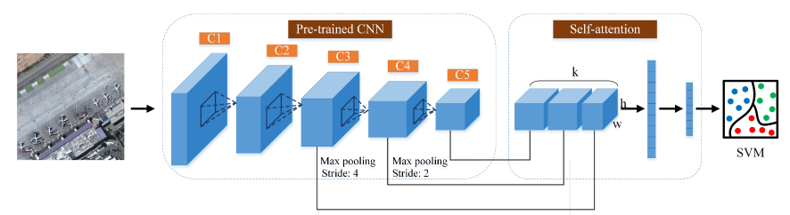
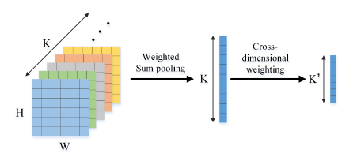
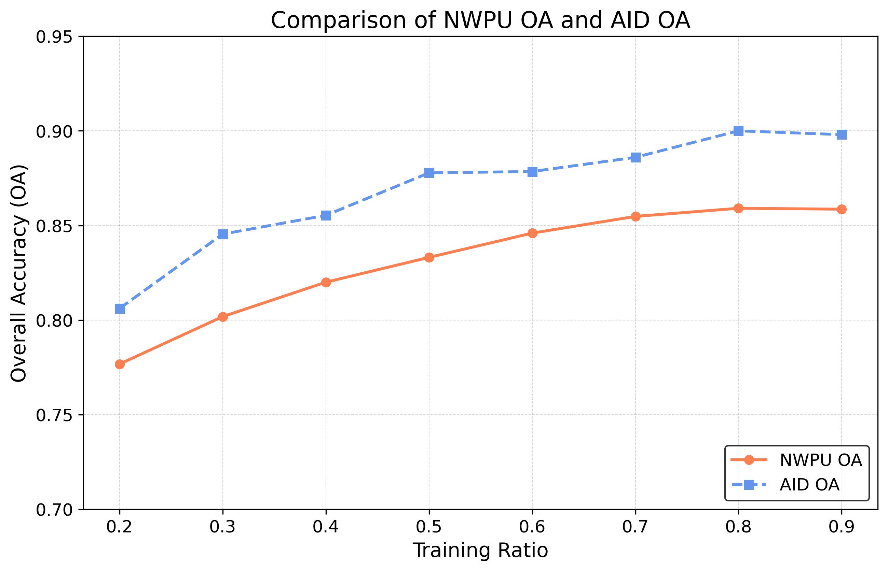

# Self-Attention-Based Deep Feature Fusion for Remote Sensing Scene Classification
Use vgg16 and SAFF for small sample classification from the [paper](https://paperswithcode.com/paper/self-attention-based-deep-feature-fusion-for).

## Introduction
* Extract dataset features using pretrained vgg16
<p align="center"></p>

* SAFF converts features into 1D tensor

<p align="center"></p>

## Environmental preparation
Create and activate the environment:
```bash
conda create -n SAFF python=3.9
conda activate SAFF
```
Install the package in requirements.txt.
## Prepare Dataset

Download the dataset in the *./dataset* folder with the following floder structure:
```
dataset
|-- NWPU
    |-- class1
    |-- class2
    |-- ...
|-- AID
    |-- class1
    |-- class2    
    |-- ...
```

## Run
If your dataset is at path  *./dataset*
Suppose you want to train on the *NWPU* dataset with train ratio 0.8, you can run the following command:

* Feature extraction
```
python run.py 
--data_path ./dataset
--extract 
--dataset NWPU
--ratio 0.8
```

* Train & verify

```
python run.py 
--data_path ./dataset
--train
--dataset NWPU
--ratio 0.8
```
The trained model parameters have been uploaded to [Baidu Netdisk](https://pan.baidu.com/s/117vQw3okXkjaA3da9WufGg?pwd=9nyj) passwd:9nyj
* Visualize
```
python visualize.py
```


## Experimental results

| dataset | train_ratio |  OA   |
|:-------:|:-----------:|:-----:|
|  NWPU   |     0.5     | 83.31 |
|  NWPU   |     0.8     | 85.90 |
|  AID    |     0.5     | 87.78 |
|  AID    |     0.8     | 90.00 |

## Comparison of NWPU OA and AID OA
<p align="center"></p>

## Note
The original program comes from [URL](https://github.com/zh-hike/SAFF).